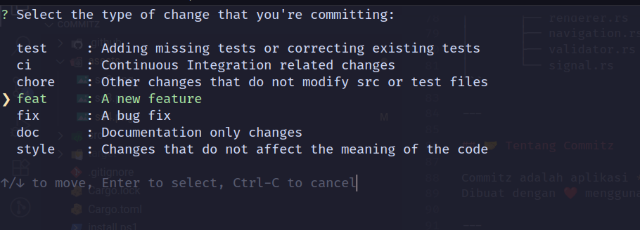
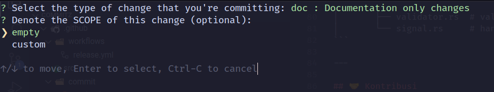
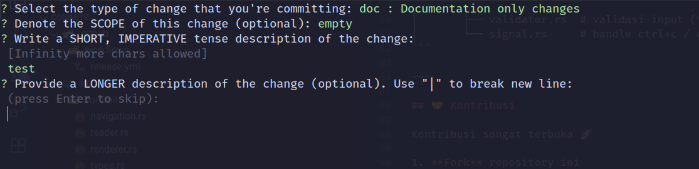
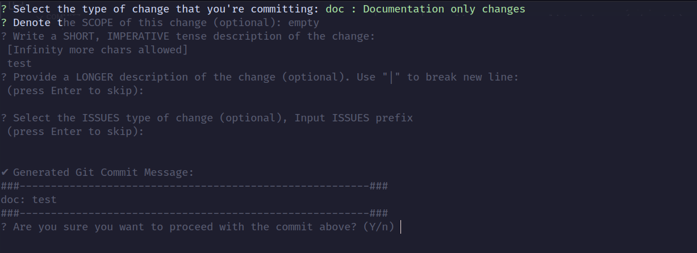

# commitz

---

## 🤝 Tentang Commitz

Commitz adalah aplikasi **TUI (Text User Interface)** untuk membantu membuat pesan commit sesuai standar konvensi.  
Dibuat dengan ❤️ menggunakan **Rust + Crossterm**.

---

## 🚀 Install

### Linux / macOS / Windows (Git Bash)

Jalankan:

```bash
bash <(curl -s https://raw.githubusercontent.com/rynsh1506/commitz/main/install.sh)
```

Lalu cek dengan:

```bash
commitz
```

---

### Windows (PowerShell)

Jalankan:

```powershell
irm https://raw.githubusercontent.com/rynsh1506/commitz/main/install.ps1 | iex
```

Lalu cek dengan:

```powershell
commitz
```

---

## 📝 Cara Pakai

1. Pastikan sudah berada di folder project Git dan jalankan:

```bash
git init

```

2. Pastikan ada file yang sudah di-`git add`.
3. Jalankan:

```bash
commitz
```

4. Pilih jenis commit dengan panah atas/bawah.
5. Isi promt pesan commit.
6. Ketik **y**/**n**, untuk menjalankan `git commit` atau membatalkan .

---

## 📂 Struktur Project

```
commitz/
├── Cargo.toml
├── README.md
├── install.sh
├── install.ps1
├── src/
│   ├── lib.rs            # expose semua module
│   ├── main.rs           # CLI entrypoint
│   └── commit/
│       ├── types.rs      # definisi CommitType, dsb
│       ├── reader.rs     # baca commit config/json
│       ├── renderer.rs   # render ke layar pakai crossterm
│       ├── navigation.rs # handle arrow key / pointer
│       └── validator.rs  # validasi input (Y/n, dsb)
```

---

### 📸 Tampilan TUI Commitz









---

## 👨‍💻 Author

Created by [@rynsh1506](https://github.com/rynsh1506)  
Jika ada ide, kritik, atau saran jangan ragu buat buka **issue** atau bikin **PR** 🚀
